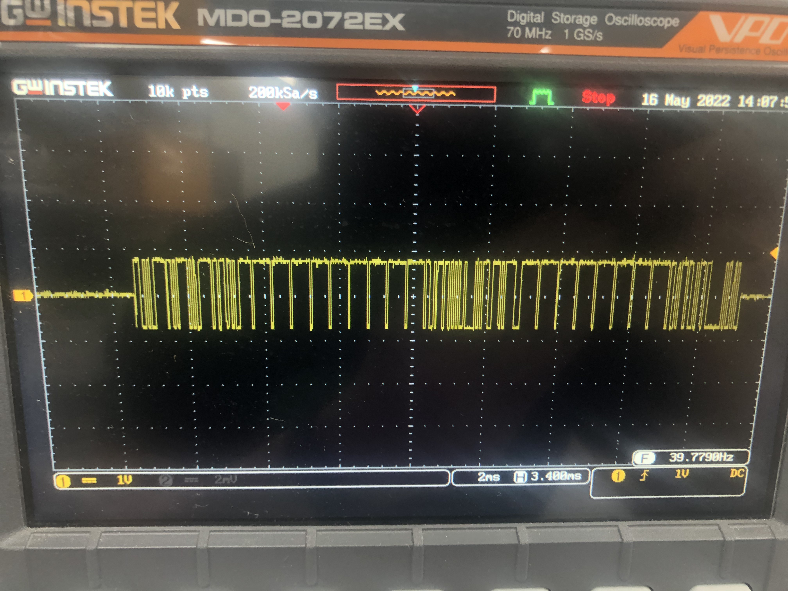
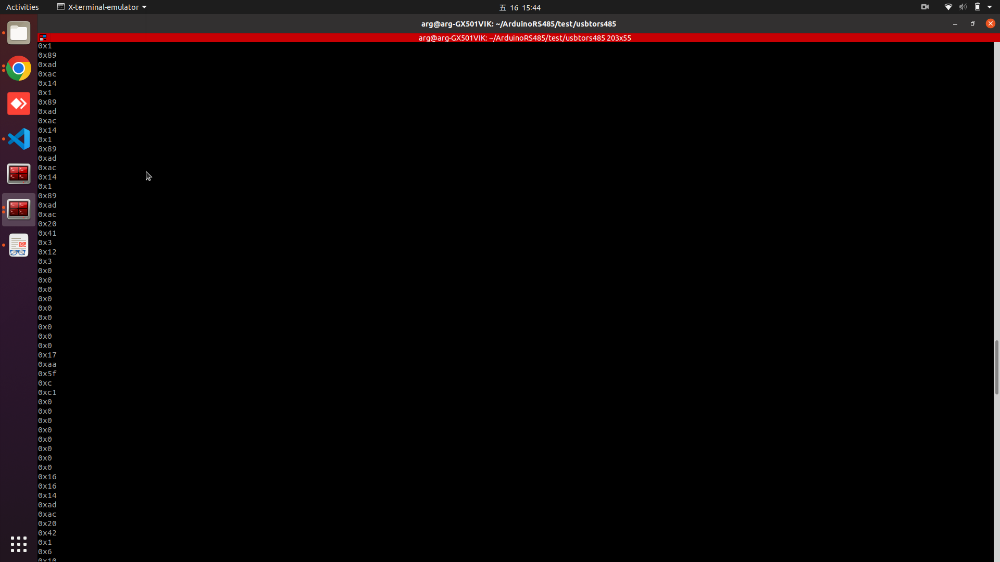

# Python usb to rs485 serial test


# How to Run

## Gazebo setup
* open sender

```
Laptop $ python serial_test.py

```


* open receiver
```
Laptop $ python aserial_test.py
```


Oscilloscope display 
* confirm message is send from messge side not controller side, and battery side act like master and will actively send message


* use pyserial rs485 module to read message

Battery side active message 
* Message send actively from battery show below

* Message decode: master will send three kinds of  message repeat as follow


0xac -> start byte

0x14 -> message id: info

0x89 -> crc byte

0xad -> stop byte

0xac -> start byte

0x20 -> display

0x42 -> systemsetup

0x01 -> flag

0x06 -> motor type

0x10 -> motor software version

0x80 -> motor software version

0x00 -> battery capacity

0x1c -> battery capacity

0x00 -> remain charge

0x01 -> 0:lead acid , 1:lithium

0x21 -> master software version

0x80 -> master software version

0x38 -> crc

0xad -> stop byte